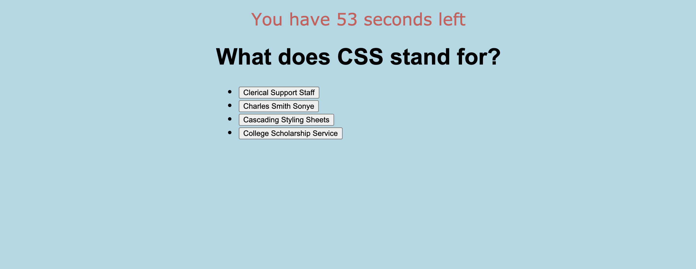
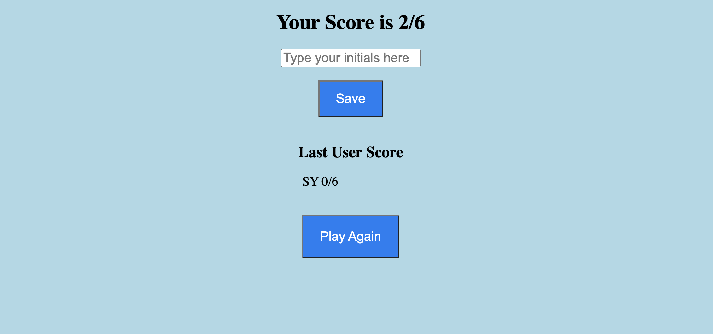

# Quiz-Code

## User Story

As I continue my journey to becoming a full-stack web developer, it is likely that I will be asked to complete a coding assessment as part of an interview process. This project
will make me familiar with these tests and give me the oportunity to demonstrate my coding skills. 

## Table of Content

* [Motivation](#motivation)
* [Description](#description)
* [Requirements](#requirements)
* [Screenshots](#screenshots)
* [Link to Page](#link-to-page)
* [Tools](#tools)

## Motivation

I want to create a timed quiz on Javascript fundamentals so that I can gauge my progress compared to my peers. 

## Description

Build a timed coding quiz with multiple-choice questions. This app will run in the browser, and will feature dynamically updated HTML and CSS powered by JavaScript code that you write.
It will have a clean, polished, and responsive user interface.

## Requirements 

This timed coding quiz will have:

* A start button that will start the quiz.
* A countdown timer.
* A question with four multiple-choice questions that will be displayed on the page after as soon as the timer begins the countdown.
* A message that will let the user know if the answer they chose is correct or incorrect.
* Another question will follow after answering the previous question.
* A scoreboard that will be displayed when the timer reaches 0 or when all the questions are answered.
* The user will save their initials.
* The last user score should be displayed.
* A button to play again.

## Screenshots

## Link to Page

<https://esmendez90.github.io/quiz-code/>

## Tools

* Visual Studio Code <https://code.visualstudio.com>.
* Chrome DevTools - Inspect
 